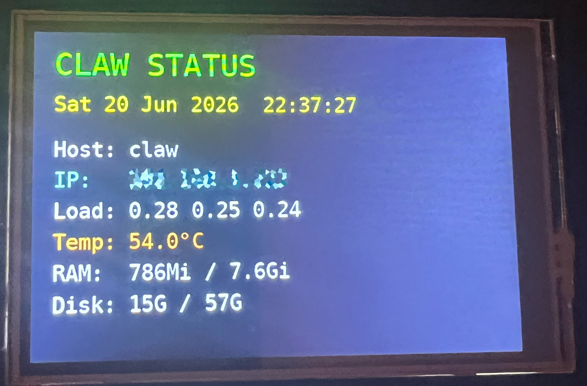
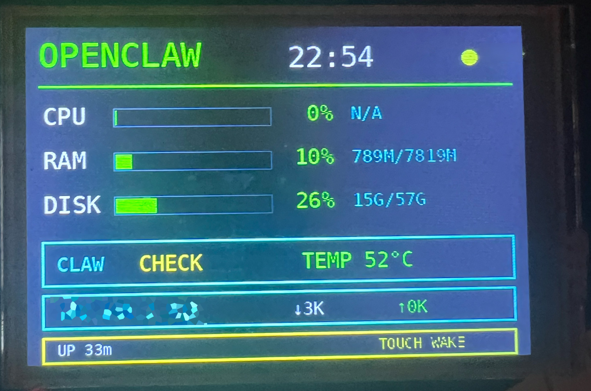

# MHS35 Pi Dashboard

A modern Python dashboard framework for MHS-3.5" SPI LCD displays based on the ILI9486 display controller and XPT2046 touch controller.

This project documents the process of bringing these inexpensive SPI displays back to life on modern Raspberry Pi OS and Debian systems where the original LCD-show and fbtft-based drivers no longer work.

---

# Features

- ILI9486 display support
- XPT2046 touch support
- Touch-to-wake
- Automatic sleep mode
- Systemd auto-start
- Custom Python dashboard framework
- Simple status dashboard example
- OpenClaw dashboard example
- Raspberry Pi 4 tested
- No LCD-show required
- No fbtft required
- Direct SPI communication

---

# Screenshots

## Simple Status Dashboard



Displays:

- Date and time
- Hostname
- IP address
- Load average
- Temperature
- RAM usage
- Disk usage

## OpenClaw Dashboard



Displays:

- OpenClaw status
- CPU usage
- RAM usage
- Disk usage
- Temperature
- Network activity
- Uptime
- Touch wake status

---

# Hardware

Tested with:

- Raspberry Pi 4 Model B
- MHS 3.5" SPI LCD
- ILI9486 display controller
- XPT2046 touch controller
- Debian 13 (Trixie)
- Raspberry Pi Kernel 6.18.x

Display wiring discovered from reverse engineering:

| Function | GPIO |
|----------|------|
| DC | GPIO25 |
| RESET | GPIO24 |
| LCD SPI | /dev/spidev0.0 |
| Touch SPI | /dev/spidev0.1 |

---

# Why This Project Exists

Many MHS35 displays ship with instructions that rely on:

- LCD-show
- fbtft_device
- fb_ili9486
- fbcp
- legacy framebuffer drivers

Modern Raspberry Pi kernels have removed or changed many of these components.

Common symptoms:

- White screen
- Missing framebuffer
- Missing fbtft modules
- Missing libraspberrypi-dev package
- LCD-show installer failures
- DRM configuration issues

This repository provides a modern alternative using Python and direct SPI communication.

---

# Installation

## Enable SPI

Edit:

```bash
sudo nano /boot/firmware/config.txt
```

Ensure:

```ini
dtparam=spi=on
```

Reboot.

---

## Install Dependencies

```bash
sudo apt update

sudo apt install python3-spidev python3-libgpiod python3-pil fonts-dejavu-core
```

---

## Clone Repository

```bash
git clone https://github.com/bobacks/mhs35-pi-dashboard.git

cd mhs35-pi-dashboard
```

---

# Running Dashboards

Simple dashboard:

```bash
sudo python3 dashboards/simple_status.py
```

OpenClaw dashboard:

```bash
sudo python3 dashboards/openclaw_status.py
```

---

# Running At Boot

Copy service:

```bash
sudo cp systemd/mhs35-dashboard.service /etc/systemd/system/
```

Reload:

```bash
sudo systemctl daemon-reload
```

Enable:

```bash
sudo systemctl enable mhs35-dashboard.service
```

Start:

```bash
sudo systemctl start mhs35-dashboard.service
```

Check:

```bash
systemctl status mhs35-dashboard.service
```

---

# Touch Support

The touchscreen is read directly from:

```text
/dev/spidev0.1
```

This avoids the need for the ADS7846 overlay.

Advantages:

- LCD and touch share SPI correctly
- No framebuffer conflicts
- Touch wake support
- Works with custom dashboards

---

# Sleep Mode

Current implementation:

- Dashboard visible
- Sleep after inactivity
- Wake on touch
- Automatic redraw

Benefits:

- Reduced power usage
- Reduced image retention
- Longer display life

---

# Creating Custom Dashboards

A dashboard only needs to:

1. Create an MHS35 object
2. Draw content
3. Call show()

Example:

```python
from mhs35_console import MHS35

d = MHS35()

d.clear("black")
d.text("Hello World", 20, 20, "white")
d.show()
```

---

# Repository Structure

```text
mhs35-pi-dashboard/
│
├── dashboards/
│   ├── simple_status.py
│   └── openclaw_status.py
│
├── docs/
│   ├── hardware.md
│   ├── troubleshooting.md
│   └── history.md
│
├── screenshots/
│   ├── simple-status.jpg
│   └── openclaw-dashboard.jpg
│
├── systemd/
│   └── mhs35-dashboard.service
│
├── mhs35_console.py
├── install.sh
└── README.md
```

---

# Troubleshooting

## White Screen

Check:

```bash
ls /dev/spidev*
```

Expected:

```text
/dev/spidev0.0
/dev/spidev0.1
```

---

## Touch Not Working

Do not enable:

```ini
dtoverlay=ads7846
```

unless specifically required.

The dashboard reads touch directly from SPI.

---

## No Display

Verify:

```bash
dtparam=spi=on
```

and reboot.

---

## Permission Errors

Run using:

```bash
sudo python3 dashboard.py
```

---

# OpenClaw Integration

The OpenClaw dashboard monitors the OpenClaw gateway process.

Example:

```text
/usr/bin/node ... openclaw/dist/index.js gateway --port 18789
```

If the process is running:

```text
CLAW RUNNING
```

Otherwise:

```text
CLAW OFFLINE
```

---

# Project History

This repository was created after reverse engineering an MHS35 display that initially only showed a white screen on a modern Raspberry Pi installation.

The project evolved through:

1. LCD-show investigation
2. DRM experiments
3. SPI reverse engineering
4. Custom Python driver creation
5. Touch support implementation
6. Sleep/wake support
7. Dashboard framework development
8. OpenClaw integration

---

# License

MIT License

---

# Credits

Developed through practical testing and reverse engineering on Raspberry Pi 4 hardware.

Special thanks to the Raspberry Pi and Linux graphics communities whose documentation helped identify modern alternatives to the legacy LCD-show approach.
